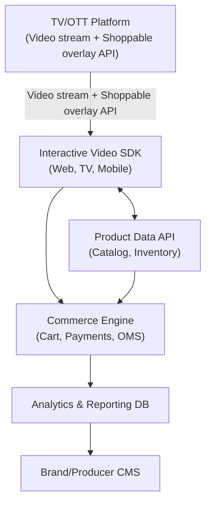

        
 
  

# Shoppable TV – In-House Solution Blueprint

## 1. Solution Overview

**Objective:**  
Enable viewers to instantly buy products featured in TV shows by integrating interactive commerce within the broadcast/streaming experience, with minimal friction.

**Approach:**  
Overlay interactive shoppable elements on live or recorded TV/video streams, manage end-to-end commerce flow (from product discovery to purchase), and provide real-time analytics to brands and producers.

---

## 2. Core Components

### A. Interactive Video Layer
- **Overlay Engine:** Integrates with video streams to display clickable product tags, pop-ups, QR codes, or interactive sidebars in real time.
- **Tech Options:** HLS/DASH player with overlay support (e.g., Video.js, Shaka Player, THEOplayer), WebGL or HTML5 Canvas for overlays.

### B. Product Data Platform
- **Product Catalog:** Centralized, real-time database of shoppable products, with metadata (images, pricing, links, inventory).
- **Content Sync:** Mechanism to tag products to specific scenes or timestamps (manual via CMS or automated using AI/computer vision).

### C. Commerce Engine
- **Cart & Checkout:** Embedded or pop-up cart that lets users buy products without leaving the TV experience.
- **Payment Integration:** Connectors for payment gateways (Razorpay, Stripe, PayPal, etc.).
- **Order Management:** Integration with backend order processing systems.

### D. User Interaction & Engagement
- **Authentication:** Optional user login or guest checkout.

# Shoppable TV – In-House Solution Blueprint
- **Multi-Device Flow:** QR codes for instant mobile checkout or casting/sharing cart to a mobile device.
- **Personalization:** Recommendations based on user profile, content context, and purchase history.

### E. Analytics & Reporting
- **Real-Time Analytics:** Track interactions, clicks, conversions, dwell time, drop-offs, and attribution per show/segment/product.
- **Brand Dashboard:** Secure web portal for brands to view campaign/product performance.

### F. Content Management System (CMS)
- **Show/Scene Tagging:** Interface for content producers to tag products in scenes.
- **Scheduling:** Plan when and where product overlays appear.

---

## 3. Solution Architecture (High-Level)

---

## 4. Key Workflows

### A. Product Tagging & Overlay
- Show producers use CMS to tag products to specific video timestamps.
- Metadata is synchronized with the video stream via API or manifest files.
- Overlay engine renders clickable/tappable product icons in real-time.

### B. User Interaction
- Viewer clicks/taps product in the overlay or scans QR code.
- Product detail modal pops up, offering “Add to Cart” or “Buy Now.”
- For Smart TVs: Allow “Add to Cart” using remote; for mobile, open cart/checkout instantly.

### C. Checkout & Fulfillment
- User completes checkout (embedded on TV or seamlessly handed off to mobile).
- Payment processed via secure gateway.
- Order confirmation shown; fulfillment details sent to backend/brand.

### D. Analytics
- Every interaction is logged in real time.
- Brand dashboard updates with live metrics.

---

## 5. Recommended Technology Stack

| Layer                     | Technology Options                                                                 |
|---------------------------|-----------------------------------------------------------------------------------|
| Frontend (Overlay/SDK)    | React/Angular for Smart TV/Web; Native Mobile SDKs; Video.js/TheoPlayer SDK       |
| Backend (APIs, Commerce)  | Node.js / Python (FastAPI, Django) / Java (Spring Boot)                           |
| Database                  | PostgreSQL / MongoDB (Product/Order data); Redis (sessions/cache)                 |
| Payments                  | Stripe, Razorpay, PayPal APIs                                                     |
| CMS                       | Custom React + Headless CMS (Strapi, Directus)                                    |
| Analytics                 | ELK Stack, Google Analytics, Segment, or custom dashboard with Grafana/Metabase   |
| Cloud/Hosting             | AWS, Azure, GCP, or on-premises Kubernetes                                        |

---

## 6. Security, Scalability & Compliance

- **User Data:** Secure checkout, GDPR-compliance, PCI DSS for payments.
- **Scalability:** Use containerization (Docker/K8s), CDN for video/overlay assets.
- **Monitoring:** Set up alerts and logging for video/commerce workflows.

---

## 7. Example User Flow

1. Viewer watches a show; product appears on screen with subtle icon/overlay.
2. Viewer clicks overlay or scans QR code on their TV/mobile.
3. Product details appear; user can buy instantly, with checkout optimized for TV/mobile.
4. Transaction is processed; confirmation displayed on TV/mobile.
5. Brand receives real-time metrics on engagement and sales.

---

## 8. Optional Advanced Features

- **AI Product Recognition:** Use AI to auto-tag products in videos (using computer vision models).
- **Voice Commerce:** Let users say “buy this” to interact with overlays (voice assistant integration).
- **Augmented Reality (AR):** Let users “try on” products using mobile camera integration.

---

## Summary

This in-house Shoppable TV solution enables end-to-end control, custom integrations, data privacy, and seamless user experience. You can build incrementally—start with manual product tagging and overlays, then enhance with AI/automation and advanced commerce features.
